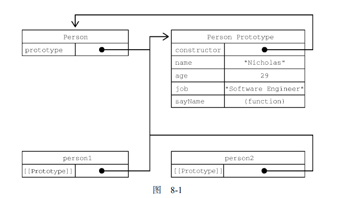
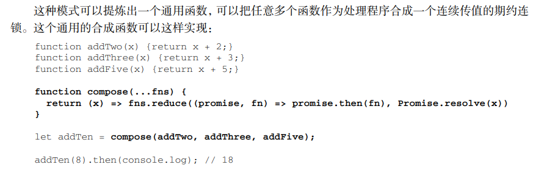

## 4.变量、作用域与内存

原始值，引用值	js中字符串是原始值，按值访问而不是按地址。

所有参数都是按值传递的，即内部不可能改变实参。

但是由于object本身是按引用访问，传入的值就是其地址，这里是对地址不产生改变。

全局上下文在浏览器中是window对象，var将成为window对象的属性和方法。

上下文在其所有代码执行完后销毁

代码执行时的标识符解析是通过沿作用域链逐级搜索标识符名称完成的。搜索过程始终从作用域链
的最前端开始，然后逐级往后，直到找到标识符。

var声明提升，赋值不提升

垃圾回收 标记清理（标记所有，去掉使用，内存清理） 引用计数（声明赋1，引用+1，覆盖-1，为0回收）动态改变阈值

const、let提高性能，注意内存泄漏

## 5.基本引用类型

### Date

Data.parse()将字符串转变为毫秒数 格式：月/日/年，月名 日 年，周几 月名 日 年 时:分:秒 时区

Date.UTC() 参数是年、零起点月数（1 月是 0，2 月是 1，以此类推）、日（1~31）、时（0~23）、分、秒和毫秒，年月必需。

Date.now() toLocalString(),toString(),valueOf()

Date显示到日，Time显示时分秒，toDateString/toTimeString...

getTime,setTime,getFullYear/month/data/day...

### RegExp

g全局模式所有匹配，i不区分大小写，m多行模式行末继续，y粘附模式只从lastIndex开始及以后，uUnicode模式，s表示元字符匹配任何字符包括\n和\r(dotAll模式)

[]内并列，元字符需要转义  没有条件式匹配和正则表达式注释

exec返回值是一个带index(匹配位置)和input(检测的字符串)属性的数组，如果设置了全局模式，每次调用会返回下一个匹配项的信息。

### 原始值包装类型 String Boolean Number

num.toPrecision(n)		IEE754	isInteger(),isSafeInteger()

str.indexOf(),str.lastIndexOf()	startsWith,endsWith,includes	 trim  repeat  padStart,padEnd

迭代器

### 单例内置对象

Global最特别的对象，代码不会显示访问它。全局作用域中的变量和函数都会变成Global的属性。内置函数有：

URL编码方法(d)|encodeURI,(d)|encodeURIComponent  (escape,unescape已经废弃)

eval		isNaN,isFinite,parseFloat,parseInt

原生引用类型构造函数(Object,function)，特殊值都是Global的属性。

Math 最大最小舍入随机

## 6.集合引用类型

### Array

from由类数组创建，可选映射函数。 of将一组参数转化为数组。

用一串”,“表示数组空位

迭代器keys(),values(),entries()，分别为索引、元素、键值对的迭代器

复制copyWithin()，填充fill()可以指定索引范围

sort()接收一个比较函数，默认为升序，若前一个参数排在后一个前面，比较函数应返回负值。

concat链接，slice切片 不改变原数组

splice插入删除替换 位置，删除个数，插入新元素...

find/findIndex使用断言函数找元素


reduce()和reduceRight()归并方法

**定型数组**

Float32Array，是一种”视图“，允许jjs访问一块名为ArrayBuffer的预分配内存。

ArrayBuffer是所有定型数组及视图引用的基本单位。一经创建就不能再调整大小。

DataView，专为文件IO和网络IO设计，其API支持对缓冲数据的高度控制，对缓冲内容没有任何预设也没有迭代，对已有的AB读取或写入时才能创建DataView实例。

强制开发者读写时指定一个ElementType

设计定型数组的目的是提高与WebGL等原生库交换二进制数据的效率。

const ints=new Int32Array(buf)

### Map

set(),get(),has(),size,delete(),clear() Map会维护键值对的插入顺序，可以迭代，entries()

插入删除内存占用Map优，查找Object优

### WeakMap

键只能是Object或继承自Object的类型

弱表示键是“弱弱地拿着”，不属于正式的引用，不会阻止垃圾回收，但值的引用不是。不能迭代

DOM节点元数据，使用弱映射时，节点一旦从DOM树删除，垃圾回收程序就可以释放其内存。

### Set/WeakSet

add(),delete() 基本与Map类似

## 7.迭代器和生成器

### 迭代器

可迭代对象，可以为临时的。nums,str,map,set,args,dom-nodelist...

任何实现Iterable接口的数据结构都可以被实现Iterator接口的结构“消费”，迭代器是按需创建的一次性对象。

**可迭代协议：**Iterable接口要求同时具备支持迭代的自我识别能力和创建实现Iterator接口的对象的能力。必须暴露一个属性作为”默认迭代器“，而且这个属性必须使用特殊的Symbol.iterator作为键，必须引用一个迭代器工厂函数，调用这个工厂函数返回一个新迭代器。

不需要显示调用工厂函数，可迭代对象原生语言特性。有：for-of，数组解构，扩展运算符，Array.from，Set/Map构造函数，Promise.all()，Promise.race()，yield*

**迭代器协议：**使用next()方法遍历，每次成功调用next都会返回一个IteratorResult对象，其中包含迭代器返回的下一个值，其包含done和value两个属性；done：boolean，是否可以再次调用next，为true时即为结束；value=done ？ undefined ：下一个值。

自定义迭代器


提前终止迭代器 return()方法，一般只返回{done:true}

如果没有关闭，则还可以从上次离开的地方继续迭代，比如数组的迭代器不能关闭。

### 生成器

生成器是 ECMAScript 6 新增的一个极为灵活的结构，拥有在一个函数块内暂停和恢复代码执行的能力。生成器的形式是一个函数，函数名称前面加一个星号（*）表示它是一个生成器。只要是可以定义函数的地方，就可以定义生成器。箭头函数不能来生成生成器函数。

调用生成器函数会产生一个生成器对象，一开始处于暂停执行状态，有next方法，返回值类似于迭代器。

生成器函数在遇到yield之前会正常执行，遇到yield执行会停止。上一次暂停时的yield关键字可以接收到传给next方法的第一个值，可以作为函数的中间参数使用。其中第一次调用next时为了开始执行生成器函数，传入的值不会被使用。

使用*增强yield的行为，使它可以产生一个可迭代对象从而一次产出一个值。


yield也可以提前关闭，所有生成器对象都有return()方法，关闭后就无法回复。

throw()会在暂停的时候将一个提供的错误注入到生成器对象中，如果错误未被处理生成器就会关闭，内部如果处理了就可以恢复运行，但会跳过对应的yield。

## 8.面向对象

浅拷贝:Object.assign(obj,src);

<br/>

### 对象

内部特性，双中括号

数据属性

- [[Configurable]]是否可以delete并重新定义/修改特性/改为访问器属性，默认为true
- [[Enumerable]]是否可以for-in，默认为true
- [[Writable]]属性值是否可以被修改，默认为true
- [[Value]]包含属性实际的值，默认为undefined

	修改默认特性需要使用Object.defineProperty()，参数为对象、属性名、{默认属性修改为}

	将Con...设为false后无法再对默认属性进行修改

访问器属性 getter，setter  前两个与数据属性一致

- [[Get]]获取函数，读取属性时调用，默认为undefined
- [[Set]]设置函数，写入属性时调用，默认为undefined
  
  定义时同数据属性

定义多个属性Object.defineProperties(className,{...})

读取属性特性Object.getOwnPropertyDescriptor(className,name)，...s读取所有属性

合并对象Object.assign既会修改目标对象，也会返回修改后的目标对象，可以接收多个源对象。执行的是浅拷贝，若有相同属性后面覆盖前面。

对象相等判定Object.is(a,b)

属性名与变量名一样时只需写变量名

可计算属性 属性名动态命名

简写方法名

对象解构 let {a,b,c}=obj，可以嵌套解构，部分解构，在函数参数列表中也可以解构。

### 创建对象

**工厂模式** 工厂函数

**构造函数模式** 与工厂函数相比，没有显式创建对象，属性和方法直接赋给了this，没有return。构造函数也是函数。其问题：不同实例上的函数同名却不相等，可以将函数定义转移到构造函数外部，构造函数内只指定函数名。

**原型模式** 每个函数都会创建一个prototype属性，这个属性是一个对象，包含应该由特定引用类型的实例共享的属性和方法。实际上，这个对象就是通过调用构造函数创建的对象的原型。上面定义的属性和方法可以被对象实例共享。

只要创建一个函数，就会为其创建一个prototype属性，指向原型对象。默认情况下所有原型对象自动获得一个constructor属性，指向与之关联的构造函数。

每次调用构造函数创建一个新实例，这个实例的内部[[Prototype]]指针就会被赋值为构造函数的原型对象。脚本中没有访问这个[[Prototype]]特性的标准方式，但 Firefox、Safari 和 Chrome会在每个对象上暴露__proto__属性，通过这个属性可以访问对象的原型。**实例与构造函数原型之间有直接的联系，但与构造函数之间没有。** 



可以使用 isPrototypeOf()方法确定两个对象之间的这种关系。本质上，isPrototypeOf()会在传入参数的[[Prototype]]指向调用它的对象时返回 true。

Object.getPrototypeOf()，返回参数的内部特性[[Prototype]]的值。set...不要使用

在通过对象访问属性时，会按照这个属性的名称开始搜索。搜索开始于对象实例本身。如果在这个实例上发现了给定的名称，则返回该名称对应的值。如果没有找到这个属性，则搜索会沿着指针进入原型对象，然后在原型对象上找到属性后，再返回对应的值。

实例对象添加属性会**遮蔽**原型对象上的属性，不会修改，屏蔽访问。

调用 hasOwnProperty()能够清楚地看到访问的是实例属性还是原型属性。

单独使用in对象上只要有就返回true，无论在实例还是原型上。for-in枚举，顺序不确定。

对象迭代 keys,values,entries

从原型上搜索值的过程是动态的，所以**即使实例在修改原型之前已经存在，任何时候对原型对
象所做的修改也会在实例上反映出来。** 因为实例和原型之间的链接是简单的指针而不是拷贝副本

原生对象原型 也可以随时为其添加方法

它弱化了向构造函数传递初始化参数的能力，会导致所有实例默认都取得相同的属性值，同时所有实例共享属性。但不同实例应该有自己的副本。

### 继承

**原型链**

默认情况下，所有引用类型都继承自 Object。instanceof | isPrototypeOf()

写新方法并覆盖旧方法

原型链的问题
    1.包含引用类型值的原型属性会被所有实例共享，在通过原型实现继承时，原型实际上会变成另一个类型的实例，原先的实例属性变成了现在的原型属性。
    2.在创建子类型的实例时，无法向父类构造函数传递参数

**借用构造函数**

function Parent(name){
        this.colors = [1,3,4];
        this.name = name;
}
function Child(name){
    Parent.call(this, name);
    this.age = 12;
}

存在的问题： 1.函数无法复用 2.父类的原型对于子类是不可见的

### 组合继承

（使用原型链继承原型属性和方法，使用借用构造继承实例属性） ---最常用的继承模式

```
缺点：无论如何都会调用两次父类构造函数
// 父类
function Parent(name){
    this.name = "xujaing";
    this.age = 12;
};
Parent.prototype.say = function() { console.log(this.age) };
// 子类继承父类
function Child(name){
    Parent.call(this, name);
    this.age = 13;
}
Child.prototype = new Parent();
Child.prototype.constructor = Child;
Child.prototype.say = function() { alert(this.age) };
```

### 原型式继承

```
实现1.
    function object(o){
        function F(){};
        F.prototype = o;
        return new F()
    }
实现2.通过Object.create(prototype, properties) // 第一个参数为创建新对象原型的对象，第二个参数为对新对象定义额外属性的对象（和defineProperties方法的第二个参数格式相同）
Object.create(person, {
    name: {
        value: "xujiang"
    }
})
```

### 寄生组合式继承

（通过借用构造函数继承属性，通过原型链混成的方式继承方法）---最理想的继承范式
    function inheritPrototype(sub,sup){
        let prototype = Object.create(sup.prototype);
        prototype.constructor = sub;
        sub.prototype = prototype;
    }

```
function Sup(){}
Sup.prototype.say = function(){}
function Sub(arg){
    // 关键
    Sup.call(this,arg);
}
// 关键
inheritPrototype(Sub, Sup);
```

## 类

class 可以包含构造函数方法，实例方法，获取函数，设置函数和静态类方法。首字母大写

静态成员每个类上只能有一个

extends 在类构造函数中使用 super 可以调用父类构造函数  

不要在调用 super()之前引用 this，否则会抛出 ReferenceError

在静态方法中可以通过 super 调用继承的类上定义的静态方法

抽象基类：可供其他类继承，但本身不会被实例化。new.target 保存通过 new 关键字调用的类或函数。通过在实例化时检测 new.target 是不是抽象基类，可以阻止对抽象基类的实例化

可以继承内置类型

**组合胜过继承**

## 9.代理与反射

### 代理基础

类似C++指针

代理是使用 Proxy 构造函数创建的。这个构造函数接收两个参数：目标对象和处理程序对象。

主要目的是可以定义**捕获器(trap)**，是处理程序对象中定义的“基本操作的拦截器”。每个处理程序对象可以包含零个或多个捕获器，每个捕获器都对应一种基本操作，可以直接或间接在代理对象上调用。每次在代理对象上调用这些基本操作时，代理可以在这些操作传播到目标对象之前先调用捕获器函数，从而拦截并修改相应的行为。

捕获器不变式：如果目标对象有一个不可配置且不可写的数据属性，那么在捕获器返回一个与该属性不同的值时，会抛出 TypeError

可撤销代理，revocable()，revoke()

反射方法适用于细粒度的对象控制与操作

状态标记Reflect.defineProperty()/preventExtensions()/set()/deleteProperty()/setPrototypeOf()

安全地应用函数，被调用的函数也可能有自己的apply属性

代理另一个代理	代理与内部槽位可能会有问题抛出错误

### 代理捕获器与反射方法

**get()** 在获取属性值的操作中被调用 返回值无限制 参数:target,property,receiver

**set()** 返回true/false 严格模式false会抛出错误 参数:target,property,value,receiver

**has()** 返回true/fasle 参数:target,property

**defineProperty()** 参数:target,property,descriptor

**getOwnPropertyDescriptor()** 参数:target,property

**deleteProperty()** 参数:target,property

**ownKeys()** 参数:target  **getPrototypeOf()** 参数:target  **setPrototypeOf()** 参数:target

### 代理模式

跟踪属性访问，隐藏属性，属性验证，函数与构造函数参数验证

通过代理可以把运行时中原本不相关的部分联系到一起。这样就可以实现各种模式，从而让不同的
代码互操作。

## 10.函数

箭头函数 无this不能使用arguments、super、new.target，也不能作构造函数，没有prototype

虽然箭头函数中没有 arguments 对象，但可以在包装函数中把它提供给箭头函数。

**没有重载** 因为没有函数签名，同名函数后定义的会覆盖先定义的

默认参数值

### 参数扩展与收集

扩展参数 (...args)，arguments对象接受每一个值

收集参数的前面如果还有命名参数，则只会收集其余的参数；如果没有则会得到空数组。

### 函数内部

arguments,this

caller callee调用者和被调用者

### 函数属性与方法

两个属性，length（命名参数个数）和prototype（保存引用类型所有实例的地方）

apply(this,[x1,x1,...])和call(this,x1,x2,...)

**尾调用优化** 确定外部栈帧没必要存在了

### 闭包

闭包指的是那些引用了另一个函数作用域中变量的函数，通常是在嵌套函数中实现的。

**立即调用的函数表达式**

**私有变量** 特权方法

模块模式：在一个单例对象上实现相同的隔离和封装

模块增强模式：在返回对象之前先对其进行增强。这适合单例对象需要是某个特定类型的实例，但又必须给它添加额外属性或方法的场景

## 11.期约与异步函数Promise

js是单线程  早期使用setTimeout等实现异步，回调函数

new Promise((resolve,reject)=>{

<br/>

})

pending fulfilled rejected三种状态

通过执行函数控制Promise状态。

new Promise((resolve,reject)=>resolve());可以实例化一个解决的Promise

reject类似，会实例化一个拒绝的Promise并抛出一个异步错误，这个错误不能通过try/catch捕获。

then方法，可以接收onResolved和onRejected两个处理程序。

catch方法，只接收onRejected处理程序，相当于.then(null,onRejected)

finally() 添加onFinally处理程序，在转换为两种状态时都会执行，主要用于添加清理代码。

非重入Promise方法

**Promise连锁与合成**

连锁，串行化异步任务。把生成Promise的函数封装到一个工厂函数中，这样子后续的处理程序都会等待前一个Promise解决再实例化一个新Promise并返回它。可以简洁地把异步任务串行化，解决地狱回调。

Promise图 是二叉树 输出顺序是二叉树的层序遍历顺序。

Promise.all()创建的Promise会在一组全部解决后解决，参数为空时等价于Promise.resolve()


如果有Promise拒绝，第一个拒绝的作为合成Promise的拒绝理由。

Promise.race()返回一组Promise中最先解决或拒绝的Promise的镜像。



**Promise扩展**  

取消令牌，cancelFn，控制什么时候取消Promise

进度通知，为Promise类添加notify()方法

### 异步函数 async/await

async声明异步函数，让函数有异步特性，但总体上仍是同步求值，其用return返回的值会被包装成Promise对象。在函数外部调用这个函数可以得到它返回的Promise

await会暂停执行异步函数后面的代码，让出js线程。

js运行时在碰到await关键字的时候，会记录在哪里暂停执行，等到await右边的值可用了，js运行时会向消息队列里推送一个任务，这个任务会恢复异步函数的执行。因此即使await后面跟着一个可以立即使用的值也会让函数的其余部分异步求值。

await后面是一个Promise的时候，向消息队列中添加一个在Promise落定之后执行的任务，Promise立即落定并把给await提供值的任务添加到消息队列。顶级线程执行完毕后，js运行时从消息队列中取出解决await Promise的处理程序，并将解决的值提供给它，向消息队列中添加一个恢复执行所在函数的任务。其他任务执行结束后，取出恢复执行的任务及值，开始执行。

**实现sleep()** 异步async function sleep(delay) {  return new Promise((resolve) => setTimeout(resolve, delay)); }

**利用平行执行** 多个await依次执行

**串行执行Promise** 迭代使用即可

**栈追踪与内存管理** 用于出错时生成栈追踪信息

## 12.BOM window对象

window 对象在浏览器中有两重身份，一个是ECMAScript 中的 Global 对象，另一个就是浏览器窗口的 JavaScript 接口。

top对象始终指向最外层窗口即浏览器本身，而parent对象指向当前窗口的父窗口。self对象即window     window.parent.parent

screenLeft，screenTop，左侧、顶部，返回的单位为css像素

moveTo：到哪里，moveBy：移动多少

物理分辨率，逻辑分辨率。转换比率window.devicePixelRatio，与每英寸像素数DPI对应

**窗口大小**：outter(inner)Width(Height)，document.documentElement.clientWidth(Height)返回页面视口的宽高。

先将pageWidth(Height)的值分别设置为 window.innerWidth(Height)。然后检查pageWidth 是不是一个数值，如果不是则通过 document.compatMode来检查页面是否处于标准模式。如果是，则使用document.documentElement.clientWidth(Height)；否则使用document.body.clientWidth(Height).

resizeTo()：缩放到；resizeBy()：缩放多少

**视口位置**：window.pageXoffset/window.scrollX 和 window.pageYoffset/window.scrollY

scroll(),scrollTo(),scrollBy()滚动页面，方法与上面类似

**导航与打开新窗口**

window.open()方法可以用于导航到指定 URL，也可以用于打开新浏览器窗口。这个方法接收4个参数：要加载的 URL、目标窗口、特性字符串、表示新窗口在浏览器历史记录中是否替代当前加载页面的布尔值。

第二个参数可以是是一个特殊的窗口名，比如_self、_parent、_top 或_blank。不是已有窗口时会打开一个新窗口或标签页，第三个参数用于指定新窗口配置，无则默认。

特性字符串是一个逗号分隔的设置字符串，用于指定新窗口包含的特性。


window.open()返回一个对新建窗口的引用，可以使用close()关闭

弹窗屏蔽程序

定时器

系统对话框：alert，confirm，prompt

### location对象

它既是 window 的属性，也是 document 的属性，不仅保存着当前加载文档的信息，也保存着把 URL 解析为离散片段后能够通过属性访问的信息。


location.search 返回了从问号开始直到 URL 末尾的所有内容

通过修改 location 对象修改浏览器的地址：location.assign(),window.location,location.href


以前面提到的方式修改 URL 之后，浏览器历史记录中就会增加相应的记录。当用户单击“后退”按钮时，就会导航到前一个页面。如果不希望增加历史记录，可以使用 replace()方法。

### navigator对象

navigator 对象的属性通常用于确定浏览器的类型

**plugins** 返回浏览器安装的插件数组，每一项包含name,description,filename,length

**registerProtocolHandler()**方法可以把一个网站注册为处理某种特定类型信息应用程序

screen对象 保存的纯粹是客户端能力信息也就是浏览器窗口外面的客户端显示器的信息

**history对象**

表示当前窗口首次使用以来用户的导航历史记录，它不会暴露用户访问过的 URL，但可以通过它在不知道实际 URL 的情况下前进和后退。

go()可以前后，可以设定步数  back()/forward()前/后一页

历史状态管理 hashchange，pushState，replaceState

## 13.客户端检测

**能力检测**即在 JavaScript 运行时中使用一套简单的检测逻辑，测试浏览器是否支持某种特性。这种方式不要求事先知道特定浏览器的信息，只需检测自己关心的能力是否存在即可。

if (object.propertyInQuestion)

使用能力检测而非用户代理检测的优点在于，伪造用户代理字符串很简单，而伪造能够欺骗能力检测的浏览器特性却很难

**用户代理检测**通过浏览器的用户代理字符串确定使用的是什么浏览器。用户代理字符串包含在每个
HTTP 请求的头部，在 JavaScript 中可以通过 navigator.userAgent 访问。

与其劳心费力检测造假，不如更好地专注于浏览器识别。如果相信浏览器返回的用户代理字符串，那就可以用它来判断浏览器。如果怀疑脚本或浏览器可能篡改这个值，那最好还是使用能力检测。

**软件与硬件检测** 识别浏览器与操作系统，浏览器元数据，硬件(核数，内存大小，最大触点数)

## 14.DOM

文档对象模型（DOM，Document Object Model）是 HTML 和 XML 文档的编程接口。通过它开发者可以添加、删除和修改页面的各个部分。

### 结点层级

document 节点表示每个文档的根节点，根节点的唯一子节点是<html>元素，我们称之为文档元素。

**Node类型** 

nodeName,nodeValue childNodes,parentNode previousSibling,nextSibling

appendChild,insertBefore replaceChild,removeChild cloneChild(深/浅拷贝)

normalize如果发现空文本节点，则将其删除，如果两个同胞节点是相邻的，则将其合并为一个文本节点

**Document类型** nodeType=9

documentElement始终指向<html>元素，document.body指向<body>元素

document.doctype	document.title document.URL document.domain:域名 document.referrer:链接到当前页面的那个页面的URL

getElementById,getElementsByTagName,getElementsByName常用于单选按钮因为需要相同名字

document.anchor带name的<a>元素  document.links带href的<a>元素

document.forms  document.images 

**Element类型** nodeType=1

HTMLElement id,title,dir,className,lang可读可写

getAttribute(),setAttribute(),removeAttribute()

document.createElement()创建新元素

再次调用访问元素后代

**Text类型** nodeType=3

appendData,deleteData,insertData,replaceData,splitText,substringData

document.createTextNode(),normalize合并,split拆分

Comment类型 nodeType=8

CDATASection nodeType=4

DocumentType nodeType=10

DocumentFragment nodeType=11

Attr nodeType=2

### DOM编程

动态脚本 动态样式

操作表格 


**NodeList**

NodeList、NamedNodeMap、HTMLCollection文档结构的变化会实时地在它们身上反映出来，每次访问它都会执行一次新的查询。考虑到这些问题，实践中要尽量减少 DOM 操作的数量

### MutationObserver

代替性能不好的 MutationEvent，使用它可以有效精准地监控DOM 变化，而且 API 也相对简单。

## 15.DOM扩展

### Selectors API

querySelector()，返回匹配的第一个后代元素

querySelectorAll()，返回匹配的所有后代元素，NodeList静态实例

matches()方法 匹配返回true否则返回false

利用firstElementChild和nextElementSibling遍历

### HTML5

getElementsByClassName() 

所有元素都有classList属性可以向类名列表添加删除add,contains,remove,toggle(存在删除不存在添加)

焦点管理 document.activeElement始终包含当前拥有焦点的DOM元素

HTMLDocument扩展 readyState是否加载完毕，compatMode渲染模式

字符集属性characterSet  自定义数据属性data-

插入标记innerHTML outerHTML整个元素内外


scrollIntoView

### 专有扩展

contains判断是否有该后代，innerText，outerText

## 16.DOM2,DOM3

Document，Element新增一些方法  isSameNode,isEqualNode等等

iframe新增contentDocument属性拥有所有文档属性和方法，contentWindow，返回相应窗格的 window 对象

### 样式

连字符表示转驼峰表示  style.cssText css代码  .length应用css属性数量  .parentRule表示CSSRule对象  item(index)  removeProperty  setProperty

计算样式只读

CSSStyleSheet类型表示CSS样式表

**CSSRule**类型表示样式表中的一条规则，表示样式信息的CSSStyleRule insertRule

元素尺寸 偏移尺寸offset... 客户端尺寸client... 滚动尺寸scroll...

NodeIterator

TreeWalker

### 范围

选择 DOM 结构中特定部分并进行操作的一种方式，通过范围的选区可以在保持文档结构完好的同时从文档中移除内容，也可复制文档中相应的部分。

## 17.事件

### 事件流

事件冒泡 最深触发，向上传播

事件捕获 顶端捕获，向下传播

事件捕获、到达目标和事件冒泡，事件捕获最先发生，为提前拦截事件提供了可能。然后，实际的目标元素接收到事件。最后一个阶段是冒泡，最迟要在这个阶段响应事件。

事件处理程序onxxxx

DOM0 给onXXXX属性赋值一个函数

DOM2 addEventListener/remove... 接收三个参数：事件名、事件处理函数、true/false(默认)表示在捕获/冒泡阶段调用事件处理程序。 **事件名没有on**

IE事件处理程序 attachEvent/detach... 接收事件处理程序的名字和事件处理函数

### 事件对象

在 DOM 合规的浏览器中，event 对象是传给事件处理程序的唯一参数

与 DOM 事件对象不同， IE 事件对象可以基于事件处理程序被指定的方式以不同方式来访问。如果事件处理程序是使用 DOM0 方式指定的，则 event 对象只是 window 对象的一个属性。


**用户界面事件** load页面加载完成后触发，unload完全卸载 resize scroll

**焦点事件** blur focus focusin focusout

**鼠标与滚轮事件** click dbclick mousedown mouseenter光标从元素外进入元素内 mouseleave相反 mousemove mouseout mouseup释放按键 mousewheel

click 事件触发的前提是mousedown事件触发后，紧接着又在同一个元素上触发了mouseup事件，连续两次click触发dbclick。DOM 为这个 button 属性定义了 3 个值：0 表示鼠标主键、1 表示鼠标中键（通常也是滚轮键）、2 表示鼠标副键。按照惯例，鼠标主键通常是左边的按键，副键通常是右边的按键。

**键盘与输入事件** keydown keypress keyup  键码:字母和数字键与小写字母和数字的ascii码一致。

DOM3中key代替keyCode，在按下字符键时，key 的值等于文本字符（如“k”或“M”）；在按下非字符键时，key 的值是键名（如“Shift”或“ArrowDown”）。char 属性在按下字符键时与 key 类似，在按下非字符键时为 null。

textInputt 只在可编辑区域上触发，只在有新字符被插入时才会触发

h5事件 设备事件 触摸及手势事件

**“过多事件处理程序”的解决方案是使用事件委托** 只使用一个事件处理程序来管理一种类型的事件

还应该及时删除不用的事件处理程序

**模拟事件** 

## 18.动画与canvas

见canvas

## 19.表单脚本

### 表单基础

action:请求的URL method:请求方法post/get submit() target

提交按钮可以使用 type 属性为"submit"的<input>或<button>元素来定义，图片按钮可以使用 type 属性为"image"的<input>元素来定义。

**表单字段** 所以表单元素都是elements属性中的一个值，有序列表，所有字段的引用，可以使用索引和name来访问。

### 文本框编程

选择文本 select()全部选中文本框中的文本  setSelectionRange()部分选中

输入过滤 正则表达式

自动切换 tabForward()，通过比较用户输入文本的长度与 maxlength属性的值来检测输入是否达到了最大长度。

约束验证 API required属性-必须填写	 email/url/tel	 数值范围、步长等-可以用来实现进度条等 	pattern-输入模式，限制输入数字等		checkValidity检测有效性		novalidate禁止对表单进行任何验证

获取选项selectedIndex

### 富文本编辑

在HTML中嵌入一个iframe通过designMode属性将这个空白文档变成可编辑的

## 20.js API

### File Blob

FileReader异步读取文件 readAsText(file,encoding) readAsDataURL(file) readAsBinaryString(file) readAsArrayBuffer(file)

progress事件，error事件，load事件

在 progress 事件中可以读取 FileReader 的 result属性，即使其中尚未包含全部数据

error 事件会在由于某种原因无法读取文件时触发。触发 error 事件时，FileReader 的 error属性会包含错误信息。这个属性是一个对象，只包含一个属性：code。这个错误码的值可能是 1（未找到文件）、2（安全错误）、3（读取被中断）、4（文件不可读）或 5（编码错误）。

load 事件会在文件成功加载后触发。如果 error 事件被触发，则不会再触发 load 事件。

FileReaderSync 类型是 FileReader 的同步版本

blob 表示二进制大对象（binary larget object），是 JavaScript 对不可修改二进制数据的封装类型

### 媒体元素

<audio><video>

canPlayType(),提供文件格式和编码格式返回是否可以播放  Audio创建audio

### 拖放事件

dragstart drag dragend

dragenter dragover dragleave(drop)

dataTransfer 对象，用于从被拖动元素向放置目标传递字符串数据，拖放事件的事件处理程序外部无法访问 dataTransfer。

dataTransfer 对象不仅可以用于实现简单的数据传输，还可以用于确定能够对被拖动元素和放置
目标执行什么操作。为此，可以使用两个属性：dropEffect 与 effectAllowed。

可拖动能力：draggable

Page Visibility API 旨在为开发者提供页面对用户是否可见的信息。document.visibilityState值hidden、visible、prerender

Streams API消费有序的小信息块 可读流、可写流、转换流

可读流是对底层数据源的封装。底层数据源可以将数据填充到流中，允许消费者通过流的公共接口
读取数据。

ReadableStreamDefaultController  ReadableStreamDefaultReader


可写流是底层数据槽的封装。底层数据槽处理通过流的公共接口写入的数据

WritableStream WritableStreamDefaultWriter

转换流用于组合可读流和可写流。数据块在两个流之间的转换是通过 transform()方法完成的

流可以通过管道连接成一串。最常见的用例是使用 pipeThrough()方法把 ReadableStream 接入
TransformStream。从内部看，ReadableStream 先把自己的值传给 TransformStream 内部的
WritableStream，然后执行转换，接着转换后的值又在新的 ReadableStream 上出现。

### 计时器API

window.performance.now()微秒精度浮点数

performance.timeOrigin 属性返回计时器初始化时全局系统时钟的值

记录自定义性能条目要使用performance.mark()方法

Navigation Timing API提供了高精度时间戳，用于度量当前页面加载速度。浏览器会在导航事件发生时自动记录PerformanceNavigationTiming条目。这个对象会捕获大量时间戳，用于描述页面是何时以及如何加载的。

PerformanceResourceTiming资源加载

### Web组件

HTML模板 <template>

<template>的内容不属于活动文档，存在于DocumentFragment中

**影子DOM** 

它可以将一个完整的 DOM 树作为节点添加到父 DOM 树。这样可以实现 DOM 封装，意味着 CSS 样式和 CSS 选择符可以限制在影子 DOM子树而不是整个顶级 DOM 树中。

影子 DOM 是通过 attachShadow()方法创建并添加给有效 HTML 元素的。容纳影子 DOM 的元素被称为影子宿主（shadow host）。影子 DOM 的根节点被称为影子根（shadow root）。

宿主.attachShadow({mode:'open'})

**合成与影子 DOM 槽位**

影子 DOM 一添加到元素中，浏览器就会赋予它最高优先级，优先渲染它的内容而不是原来的文本。为了显示文本内容，需要使用<slot>标签指示浏览器在哪里放置原来的 HTML。

带有 slot="foo"属性的元素会被投射到带有 name="foo"的<slot>上

<br/>

如果影子 DOM 中发生了浏览器事件（如 click），那么浏览器需要一种方式以让父 DOM 处理事件。事件会逃出影子 DOM 并经过事件重定向（event retarget）在外部被处理。逃出后，事件就好像是由影子宿主本身而非真正的包装元素触发的一样。

**自定义元素**

标签不能自关闭


不能在构造函数中添加子 DOM（会抛出 DOMException），但可以为自定义元素添加影子 DOM 并将内容添加到这个影子 DOM 中。


### Web Cryptography API 

描述了一套密码学工具，规范了 JavaScript 如何以安全和符合惯例的方式实现加密。这些工具包括生成、使用和应用加密密钥对，加密和解密消息，以及可靠地生成随机数。

crypto.getRandomValues(arr)把生成的随机值写入到arr

SubtleCrypto 通过 window.crypto. subtle 访问

使用 SubtleCrypto.generateKey()方法可以生成随机 CryptoKey

## 处理XML

DOM Level 2 提供了创建空 XML 文档的 API，但不能解析和序列化。浏览器为解析和序列化 XML 实现了两个新类型。

DOMParser 类型是简单的对象，可以将 XML 字符串解析为 DOM 文档。

XMLSerializer 类型执行相反操作，将 DOM 文档序列化为 XML 字符串。

基于所有主流浏览器的实现，DOM Level 3 新增了针对 XPath API 的规范。该 API 可以让 JavaScript针对 DOM 文档执行任何 XPath 查询并得到不同数据类型的结果。

## JSON

JSON 是 JavaScript 的严格子集，利用 JavaScript 中的几种模式来表示结构化数据。JSON 可以直接传给 eval()而不需要创建 DOM。通用数据格式。

stringify()和 parse()分别将JavaScript序列化为JSON字符串，JSON解析为原生JavaScript值